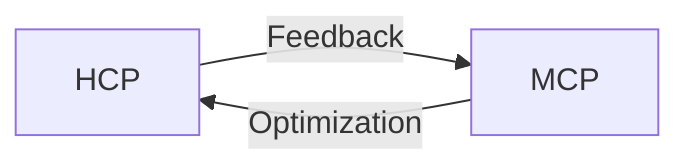

# Bi-Co-Pilot Design

## Overview
Dual AI system with:
- **Human Co-Pilot (HCP)**: Voice/text interface for users  
- **Machine Co-Pilot (MCP)**: Auto-optimizes other AI models  

## Components

### Key Features
1. **Authentication**: OAuth2 + JWT  
2. **Monitoring**: Prometheus + Grafana  
3. **Error Handling**: Retry logic + logging  